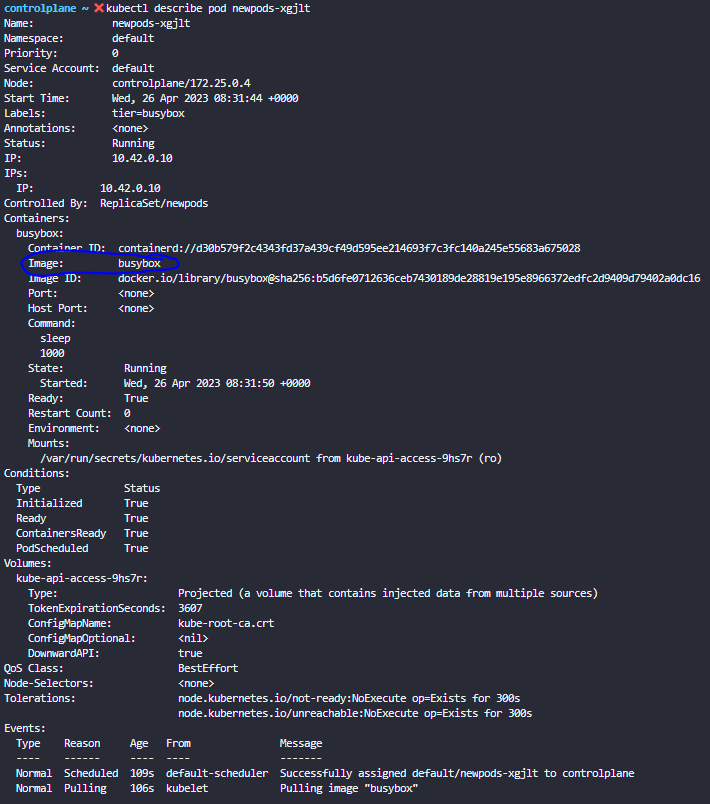

# 1 
How many pods exist on the system?

In the current(default) namespace.
```bash
kubectl get pods
```

# 2 
Create a new pod with the nginx image
````bash
kubectl run nginx --image=nginx
````

# 3
How many pods are created now?

Note: We have created a few more pods. So please check again.

````bash
kubectl get pods 
````

# 4
What is the image used to create the new pods?

You must look at one of the new pods in detail to figure this out.

````
kubectl describe pod newpods-<id>
````




# 5 

Which nodes are these pods placed on?


You must look at all the pods in detail to figure this out.

Run the command **kubectl describe pod newpods-<id>** and look at the node field.

Alternatively run **kubectl get pods -o wide** and check for the node the pod is placed on.

# 6

How many containers are part of the pod webapp?

````
kubectl describe pod webapp
````

look under the Containers section.

# 7 
What images are used in the new webapp pod?

# 8 
What is the state of the container agentx in the pod webapp?

Wait for it to finish the ContainerCreating state
````
kubectl describe pod webapp
````

# 9 
What does the READY column in the output of the kubectl get pods command indicate?

````
Running Containers in POD/Total Containers in POD
````

# 8 
Delete the webapp Pod.

````
kubectl delete pod webapp
````

# 9 
Create a new pod with the name redis and with the image redis123.

We use kubectl run command with --dry-run=client -o yaml option to create a manifest file :-
````
root@controlplane:~# kubectl run redis --image=redis123 --dry-run=client -o yaml > redis-definition.yaml
````
After that, using kubectl create -f command to create a resource from the manifest file :-
````
root@controlplane:~# kubectl create -f redis-definition.yaml 
````
Verify the work by running kubectl get command :-
````
root@controlplane:~# kubectl get pods
````

# 10
Now change the image on this pod to redis.

Once done, the pod should be in a running state.

Use the kubectl edit command to update the image of the pod to redis.
````
root@controlplane:~# kubectl edit pod redis
````
If you used a pod definition file then update the image from redis123 to redis in the definition file via Vi or Nano editor and then run kubectl apply command to update the image :-
````
root@controlplane:~# kubectl apply -f redis-definition.yaml 
````