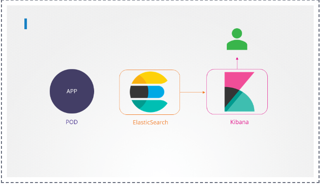
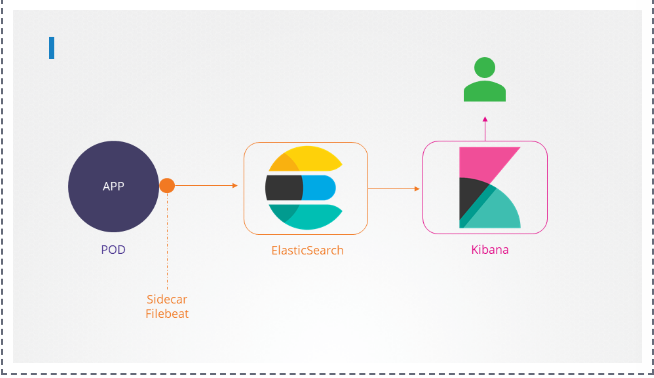

# Multi-container Pods

3 design pattern 
Sidecar: log sever, collect log  
Adapter: many log sever, before send log sever , convert same format 
Ambassador: many connecvity: Dev Test, Prod

## 1. Identify the number of containers created in the red pod.

```bash
controlplane ~ ➜  kubectl get pods
NAME        READY   STATUS              RESTARTS   AGE
app         0/1     ContainerCreating   0          38s
fluent-ui   0/1     ContainerCreating   0          38s
red         0/3     ContainerCreating   0          26s
```
```bash
controlplane ~ ✖ k describe pod red
Name:             red
Namespace:        default
Priority:         0
Service Account:  default
Node:             controlplane/192.19.189.6
Start Time:       Thu, 27 Apr 2023 05:15:15 -0400
Labels:           <none>
Annotations:      <none>
Status:           Pending
IP:               
IPs:              <none>
Containers:
  apple:
    Container ID:  
    Image:         busybox
    Image ID:      
    Port:          <none>
    Host Port:     <none>
    Command:
      sleep
      4500
    State:          Waiting
      Reason:       ContainerCreating
    Ready:          False
    Restart Count:  0
    Environment:    <none>
    Mounts:
      /var/run/secrets/kubernetes.io/serviceaccount from kube-api-access-zckc8 (ro)
  wine:
    Container ID:  
    Image:         busybox
    Image ID:      
    Port:          <none>
    Host Port:     <none>
    Command:
      sleep
      4500
    State:          Waiting
      Reason:       ContainerCreating
    Ready:          False
    Restart Count:  0
    Environment:    <none>
    Mounts:
      /var/run/secrets/kubernetes.io/serviceaccount from kube-api-access-zckc8 (ro)
  scarlet:
    Container ID:  
    Image:         busybox
    Image ID:      
    Port:          <none>
    Host Port:     <none>
    Command:
      sleep
      4500
    State:          Waiting
      Reason:       ContainerCreating
    Ready:          False
    Restart Count:  0
    Environment:    <none>
    Mounts:
      /var/run/secrets/kubernetes.io/serviceaccount from kube-api-access-zckc8 (ro)
Conditions:
  Type              Status
  Initialized       True 
  Ready             False 
  ContainersReady   False 
  PodScheduled      True 
Volumes:
  kube-api-access-zckc8:
    Type:                    Projected (a volume that contains injected data from multiple sources)
    TokenExpirationSeconds:  3607
    ConfigMapName:           kube-root-ca.crt
    ConfigMapOptional:       <nil>
    DownwardAPI:             true
QoS Class:                   BestEffort
Node-Selectors:              <none>
Tolerations:                 node.kubernetes.io/not-ready:NoExecute op=Exists for 300s
                             node.kubernetes.io/unreachable:NoExecute op=Exists for 300s
Events:
  Type    Reason     Age   From               Message
  ----    ------     ----  ----               -------
  Normal  Scheduled  86s   default-scheduler  Successfully assigned default/red to controlplane
  Normal  Pulling    85s   kubelet            Pulling image "busybox"
  Normal  Pulled     2s    kubelet            Successfully pulled image "busybox" in 3.003012612s (1m23.180576028s including waiting)
  Normal  Created    1s    kubelet            Created container apple
  Normal  Started    0s    kubelet            Started container apple
  Normal  Pulling    0s    kubelet            Pulling image "busybox"
```
and look at under the Ready section.

3

## 2. Identify the name of the containers running in the blue pod.
```bash
controlplane ~ ✖ kubectl describe pod blue
```

## 3. Create a multi-container pod with 2 containers.

Use the spec given below.

If the pod goes into the crashloopbackoff then add the command sleep 1000 in the lemon container.


```bash
controlplane ~ ✖ k run yellow --image=busybox --dry-run=client -o yaml
apiVersion: v1
kind: Pod
metadata:
  creationTimestamp: null
  labels:
    run: yellow
  name: yellow
spec:
  containers:
  - image: busybox
    name: yellow
    resources: {}
  dnsPolicy: ClusterFirst
  restartPolicy: Always
status: {}

controlplane ~ ➜  k run yellow --image=busybox --dry-run=client -o yaml > yellow.yaml
```
```bash
controlplane ~ ➜  vi yellow.yaml
```
Change yellow.yaml
```yaml
apiVersion: v1
kind: Pod
metadata:
  name: yellow
spec:
  containers:
  - name: lemon
    image: busybox
    command:
      - sleep
      - "1000"

  - name: gold
    image: redis
```

```bash
controlplane ~ ✖ k create -f yellow.yaml
pod/yellow created
```
```bash
controlplane ~ ✖ k describe pod yellow 
Name:             yellow
Namespace:        default
Priority:         0
Service Account:  default
Node:             controlplane/192.19.189.6
Start Time:       Thu, 27 Apr 2023 05:22:45 -0400
Labels:           run=yellow
Annotations:      <none>
Status:           Running
IP:               10.244.0.11
IPs:
  IP:  10.244.0.11
Containers:
  lemon:
    Container ID:  containerd://0ea306bd7841519b31573f8a2f767dec4c3fbadd688b5f13d16ac270ddd641f2
    Image:         busybox
    Image ID:      docker.io/library/busybox@sha256:b5d6fe0712636ceb7430189de28819e195e8966372edfc2d9409d79402a0dc16
    Port:          <none>
    Host Port:     <none>
    Command:
      sleep
      1000
    State:          Running
      Started:      Thu, 27 Apr 2023 05:22:47 -0400
    Ready:          True
    Restart Count:  0
    Environment:    <none>
    Mounts:
      /var/run/secrets/kubernetes.io/serviceaccount from kube-api-access-cd8c9 (ro)
  gold:
    Container ID:   containerd://1e380ecb1fc79c59e73abeb3aa36414144d8ebc6817c4faabceda2bb2a6003db
    Image:          redis
    Image ID:       docker.io/library/redis@sha256:f50031a49f41e493087fb95f96fdb3523bb25dcf6a3f0b07c588ad3cdbe1d0aa
    Port:           <none>
    Host Port:      <none>
    State:          Running
      Started:      Thu, 27 Apr 2023 05:22:52 -0400
    Ready:          True
    Restart Count:  0
    Environment:    <none>
    Mounts:
      /var/run/secrets/kubernetes.io/serviceaccount from kube-api-access-cd8c9 (ro)
```

## 4. We have deployed an application logging stack in the elastic-stack namespace. Inspect it.


Before proceeding with the next set of questions, please wait for all the pods in the elastic-stack namespace to be ready. This can take a few minutes.



```bash
controlplane ~ ➜  k get pods 
NAME        READY   STATUS    RESTARTS   AGE
app         1/1     Running   0          12m
blue        2/2     Running   0          9m46s
fluent-ui   1/1     Running   0          12m
red         3/3     Running   0          12m
yellow      2/2     Running   0          5m16s

controlplane ~ ➜  k get node
NAME           STATUS   ROLES           AGE   VERSION
controlplane   Ready    control-plane   14m   v1.26.0

controlplane ~ ➜  kubectl get namespaces
NAME              STATUS   AGE
default           Active   15m
elastic-stack     Active   14m
kube-flannel      Active   15m
kube-node-lease   Active   15m
kube-public       Active   15m
kube-system       Active   15m

controlplane ~ ➜  k get pods -n elastic-stack
NAME             READY   STATUS    RESTARTS   AGE
app              1/1     Running   0          14m
elastic-search   1/1     Running   0          14m
kibana           1/1     Running   0          14m
```
Note: Transfer log from app to ElasticSearch
## 5. Once the pod is in a ready state, inspect the Kibana UI using the link above your terminal. There shouldn't be any logs for now.


We will configure a sidecar container for the application to send logs to Elastic Search.

NOTE: It can take a couple of minutes for the Kibana UI to be ready after the Kibana pod is ready.

You can inspect the Kibana logs by running:

```bash
kubectl -n elastic-stack logs kibana
```

## 6. Inspect the app pod and identify the number of containers in it.

It is deployed in the elastic-stack namespace.
```bash
controlplane ~ ➜  kubectl describe pod app -n elastic-stack
Name:             app
Namespace:        elastic-stack
Priority:         0
Service Account:  default
Node:             controlplane/192.19.189.6
Start Time:       Thu, 27 Apr 2023 05:15:02 -0400
Labels:           name=app
Annotations:      <none>
Status:           Running
IP:               10.244.0.5
IPs:
  IP:  10.244.0.5
Containers:
  app:
    Container ID:   containerd://1c4fa3a68ec8a8edb0f11f361a17baa28eff108117ffaeb95f591327f63aba74
    Image:          kodekloud/event-simulator
    Image ID:       docker.io/kodekloud/event-simulator@sha256:1e3e9c72136bbc76c96dd98f29c04f298c3ae241c7d44e2bf70bcc209b030bf9
    Port:           <none>
    Host Port:      <none>
    State:          Running
      Started:      Thu, 27 Apr 2023 05:15:37 -0400
    Ready:          True
    Restart Count:  0
    Environment:    <none>
    Mounts:
      /log from log-volume (rw)
      /var/run/secrets/kubernetes.io/serviceaccount from kube-api-access-dmzht (ro)
```
Ans: 1: app

## 7. The application outputs logs to the file /log/app.log. View the logs and try to identify the user having issues with Login.

Inspect the log file inside the pod.

Identify user haveing issues with Login
```bash
k logs app -n elastic-stack
```
or
```bash
kubectl -n elastic-stack exec -it app -- cat /log/app.log
---
[2023-04-27 09:36:01,849] WARNING in event-simulator: USER5 Failed to Login as the account is locked due to MANY FAILED ATTEMPTS.
---
```

## 8. Edit the pod to add a sidecar container to send logs to Elastic Search. Mount the log volume to the sidecar container.

Only add a new container. Do not modify anything else. Use the spec provided below.

Note: State persistence concepts are discussed in detail later in this course. For now please make use of the below documentation link for updating the concerning pod.

https://kubernetes.io/docs/tasks/access-application-cluster/communicate-containers-same-pod-shared-volume/


- Name: app
- Container Name: sidecar
- Container Image: kodekloud/filebeat-configured
- Volume Mount: log-volume
- Mount Path: /var/log/event-simulator/
- Existing Container Name: app
- Existing Container Image: kodekloud/event-simulator



```yaml
apiVersion: v1
kind: Pod
metadata:
  name: app
  namespace: elastic-stack
  labels:
    name: app
spec:
  containers:
  - name: app
    image: kodekloud/event-simulator
    volumeMounts:
    - mountPath: /log
      name: log-volume

  - name: sidecar
    image: kodekloud/filebeat-configured
    volumeMounts:
    - mountPath: /var/log/event-simulator/
      name: log-volume

  volumes:
  - name: log-volume
    hostPath:
      # directory location on host
      path: /var/log/webapp
      # this field is optional
      type: DirectoryOrCreate
```

```bash
controlplane ~ ➜  k edit pod app -n elastic-stack
error: pods "app" is invalid
A copy of your changes has been stored to "/tmp/kubectl-edit-1349106174.yaml"
error: Edit cancelled, no valid changes were saved.

controlplane ~ ✖ k replace --force -f /tmp/kubectl-edit-1349106174.yaml
pod "app" deleted
pod/app replaced
```

```bash
```