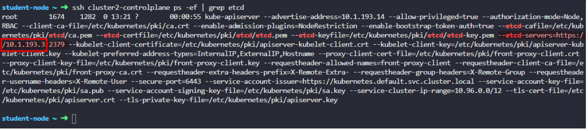
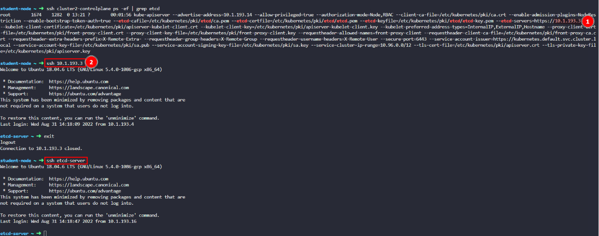

# Practice Test Backup and Restore Methods 2

## 1. In this lab environment, you will get to work with ``multiple`` kubernetes clusters where we will practice backing up and restoring the ``ETCD`` database.

## 2. You will notice that, you are logged in to the ``student-node`` (instead of the ``controlplane``).

The ``student-node`` has the ``kubectl`` client and has access to all the ``Kubernetes`` clusters that are configured in thie lab environment.

Before proceeding to the next question, explore the ``student-node`` and the clusters it has access to.

## 3. How many ``clusters`` are defined in the kubeconfig on the ``student-node``?


You can make use of the ``kubectl config ``command.

Solution 

```bash
student-node ~ ➜  kubectl config view
apiVersion: v1
clusters:
- cluster:
    certificate-authority-data: DATA+OMITTED
    server: https://cluster1-controlplane:6443
  name: cluster1
- cluster:
    certificate-authority-data: DATA+OMITTED
    server: https://192.22.3.12:6443
  name: cluster2
contexts:
- context:
    cluster: cluster1
    user: cluster1
  name: cluster1
- context:
    cluster: cluster2
    user: cluster2
  name: cluster2
current-context: cluster1
kind: Config
preferences: {}
users:
- name: cluster1
  user:
    client-certificate-data: REDACTED
    client-key-data: REDACTED
- name: cluster2
  user:
    client-certificate-data: REDACTED
    client-key-data: REDACTED
```

```bash
student-node ~ ➜  kubectl config get-clusters
NAME
cluster1
cluster2
```

## 4. How many nodes (both controlplane and worker) are part of ``cluster1``?

Make sure to switch the context to ``cluster1``:

```bash
student-node ~ ➜  kubectl config use-context cluster1
Switched to context "cluster1".

student-node ~ ➜  kubectl get nodes
NAME                    STATUS   ROLES           AGE   VERSION
cluster1-controlplane   Ready    control-plane   51m   v1.24.0
cluster1-node01         Ready    <none>          50m   v1.24.0
```
2

## 5. What is the name of the controlplane node in cluster2?

Make sure to switch the context to cluster2:

```bash
student-node ~ ➜  kubectl config use-context cluster2
Switched to context "cluster2".

student-node ~ ➜  kubectl get node
NAME                    STATUS   ROLES           AGE   VERSION
cluster2-controlplane   Ready    control-plane   52m   v1.24.0
cluster2-node01         Ready    <none>          51m   v1.24.0
```
The name of the controlplane node is cluster2-controlplane

## 6. You can SSH to all the nodes (of both clusters) from the ``student-node``.

For example:
```bash
You can SSH to all the nodes (of both clusters) from the student-node.


For example:
```
To get back to the ``student`` node, use the ``logout ``or ``exit`` command, or, hit ``Control +D``

```bash
cluster1-controlplane ~ ➜  logout
Connection to cluster1-controlplane closed.

student-node ~ ➜ 
```
Solution:

```bash
student-node ~ ➜  kubectl config use-context cluster2
Switched to context "cluster2".

student-node ~ ➜  kubectl get node
NAME                    STATUS   ROLES           AGE   VERSION
cluster2-controlplane   Ready    control-plane   54m   v1.24.0
cluster2-node01         Ready    <none>          53m   v1.24.0
```

## 7. How is ``ETCD ``configured for ``cluster1``?


Remember, you can access the clusters from ``student-node`` using the ``kubectl`` tool. You can also ``ssh`` to the cluster nodes from the ``student-node``.


Make sure to switch the context to ``cluster1``:
```bash
kubectl config use-context cluster1
```

Solution: 

If you check out the pods running in the ``kube-system`` namespace in ``cluster1``, you will notice that ``etcd`` is running as a pod:

```bash
student-node ~ ➜  kubectl config use-context cluster1
Switched to context "cluster1".

student-node ~ ➜  kubectl get pods -n kube-system | grep etcd
etcd-cluster1-controlplane                      1/1     Running   0             55m
```
This means that ETCD is set up as a ``Stacked ETCD`` Topology where the distributed data storage cluster provided by ``etcd`` is stacked on top of the cluster formed by the nodes managed by kubeadm that run control plane components.

Stacked ETCD

## 8. How is ``ETCD ``configured for ``cluster2``?

Remember, you can access the clusters from ``student-node`` using the ``kubectl`` tool. You can also ``ssh`` to the cluster nodes from the ``student-node``.


Make sure to switch the context to cluster2:
```bash
kubectl config use-context cluster2
```
Solution: 
If you check out the pods running in the ``kube-system`` namespace in ``cluster2``, you will notice that there are NO ``etcd`` pods running in this cluster!
```bash
student-node ~ ➜  kubectl config use-context cluster2
Switched to context "cluster2".

student-node ~ ➜  kubectl get pods -n kube-system  | grep etcd
```
Also, there is NO static pod configuration for etcd under the static pod path:
```bash
student-node ~ ✖ ssh cluster2-controlplane
Welcome to Ubuntu 18.04.6 LTS (GNU/Linux 5.4.0-1103-gcp x86_64)

 * Documentation:  https://help.ubuntu.com
 * Management:     https://landscape.canonical.com
 * Support:        https://ubuntu.com/advantage
This system has been minimized by removing packages and content that are
not required on a system that users do not log into.

To restore this content, you can run the 'unminimize' command.

cluster2-controlplane ~ ➜  ls /etc/kubernetes/manifests/ | grep -i etcd
```
However, if you inspect the process on the controlplane for cluster2, you will see that that the process for the ``kube-apiserver`` is referencing an external etcd datastore:
```bash
cluster2-controlplane ~ ✖ ps -ef | grep etcd
root        1736    1349  0 15:38 ?        00:03:07 kube-apiserver --advertise-address=192.22.3.12 --allow-privileged=true --authorization-mode=Node,RBAC --client-ca-file=/etc/kubernetes/pki/ca.crt --enable-admission-plugins=NodeRestriction --enable-bootstrap-token-auth=true --etcd-cafile=/etc/kubernetes/pki/etcd/ca.pem --etcd-certfile=/etc/kubernetes/pki/etcd/etcd.pem --etcd-keyfile=/etc/kubernetes/pki/etcd/etcd-key.pem --etcd-servers=https://192.22.3.23:2379 --kubelet-client-certificate=/etc/kubernetes/pki/apiserver-kubelet-client.crt --kubelet-client-key=/etc/kubernetes/pki/apiserver-kubelet-client.key --kubelet-preferred-address-types=InternalIP,ExternalIP,Hostname --proxy-client-cert-file=/etc/kubernetes/pki/front-proxy-client.crt --proxy-client-key-file=/etc/kubernetes/pki/front-proxy-client.key --requestheader-allowed-names=front-proxy-client --requestheader-client-ca-file=/etc/kubernetes/pki/front-proxy-ca.crt --requestheader-extra-headers-prefix=X-Remote-Extra- --requestheader-group-headers=X-Remote-Group --requestheader-username-headers=X-Remote-User --secure-port=6443 --service-account-issuer=https://kubernetes.default.svc.cluster.local --service-account-key-file=/etc/kubernetes/pki/sa.pub --service-account-signing-key-file=/etc/kubernetes/pki/sa.key --service-cluster-ip-range=10.96.0.0/12 --tls-cert-file=/etc/kubernetes/pki/apiserver.crt --tls-private-key-file=/etc/kubernetes/pki/apiserver.key
root        8633    8432  0 16:39 pts/0    00:00:00 grep etcd
```
You can see the same information by inspecting the ``kube-apiserver`` pod (which runs as a static pod in the kube-system namespace):
```bash
cluster2-controlplane ~ ✖ kubectl -n kube-system describe pod kube-apiserver-cluster2-controlplane
Name:                 kube-apiserver-cluster2-controlplane
Namespace:            kube-system
Priority:             2000001000
Priority Class Name:  system-node-critical
Node:                 cluster2-controlplane/192.22.3.12
Start Time:           Sat, 29 Apr 2023 15:38:21 +0000
Labels:               component=kube-apiserver
                      tier=control-plane
Annotations:          kubeadm.kubernetes.io/kube-apiserver.advertise-address.endpoint: 192.22.3.12:6443
                      kubernetes.io/config.hash: a63e929c8a756868712d0c694f9f168b
                      kubernetes.io/config.mirror: a63e929c8a756868712d0c694f9f168b
                      kubernetes.io/config.seen: 2023-04-29T15:38:20.845147769Z
                      kubernetes.io/config.source: file
                      seccomp.security.alpha.kubernetes.io/pod: runtime/default
Status:               Running
IP:                   192.22.3.12
IPs:
  IP:           192.22.3.12
Controlled By:  Node/cluster2-controlplane
Containers:
  kube-apiserver:
    Container ID:  containerd://0b0ad2df8dab76e07837f20740253c9dd458244c1ecb74a9269a39120dda8fb9
    Image:         k8s.gcr.io/kube-apiserver:v1.24.0
    Image ID:      k8s.gcr.io/kube-apiserver@sha256:a04522b882e919de6141b47d72393fb01226c78e7388400f966198222558c955
    Port:          <none>
    Host Port:     <none>
    Command:
      kube-apiserver
      --advertise-address=192.22.3.12
      --allow-privileged=true
      --authorization-mode=Node,RBAC
      --client-ca-file=/etc/kubernetes/pki/ca.crt
      --enable-admission-plugins=NodeRestriction
      --enable-bootstrap-token-auth=true
      --etcd-cafile=/etc/kubernetes/pki/etcd/ca.pem
      --etcd-certfile=/etc/kubernetes/pki/etcd/etcd.pem
      --etcd-keyfile=/etc/kubernetes/pki/etcd/etcd-key.pem
      --etcd-servers=https://192.22.3.23:2379
      --kubelet-client-certificate=/etc/kubernetes/pki/apiserver-kubelet-client.crt
      --kubelet-client-key=/etc/kubernetes/pki/apiserver-kubelet-client.key
      --kubelet-preferred-address-types=InternalIP,ExternalIP,Hostname
      --proxy-client-cert-file=/etc/kubernetes/pki/front-proxy-client.crt
      --proxy-client-key-file=/etc/kubernetes/pki/front-proxy-client.key
      --requestheader-allowed-names=front-proxy-client
      --requestheader-client-ca-file=/etc/kubernetes/pki/front-proxy-ca.crt
      --requestheader-extra-headers-prefix=X-Remote-Extra-
      --requestheader-group-headers=X-Remote-Group
      --requestheader-username-headers=X-Remote-User
      --secure-port=6443
      --service-account-issuer=https://kubernetes.default.svc.cluster.local
      --service-account-key-file=/etc/kubernetes/pki/sa.pub
      --service-account-signing-key-file=/etc/kubernetes/pki/sa.key
      --service-cluster-ip-range=10.96.0.0/12
      --tls-cert-file=/etc/kubernetes/pki/apiserver.crt
      --tls-private-key-file=/etc/kubernetes/pki/apiserver.key
    State:          Running
      Started:      Sat, 29 Apr 2023 15:38:05 +0000
    Ready:          True
    Restart Count:  0
    Requests:
      cpu:        250m
    Liveness:     http-get https://192.22.3.12:6443/livez delay=10s timeout=15s period=10s #success=1 #failure=8
    Readiness:    http-get https://192.22.3.12:6443/readyz delay=0s timeout=15s period=1s #success=1 #failure=3
    Startup:      http-get https://192.22.3.12:6443/livez delay=10s timeout=15s period=10s #success=1 #failure=24
    Environment:  <none>
    Mounts:
      /etc/ca-certificates from etc-ca-certificates (ro)
      /etc/kubernetes/pki from k8s-certs (ro)
      /etc/ssl/certs from ca-certs (ro)
      /usr/local/share/ca-certificates from usr-local-share-ca-certificates (ro)
      /usr/share/ca-certificates from usr-share-ca-certificates (ro)
Conditions:
  Type              Status
  Initialized       True 
  Ready             True 
  ContainersReady   True 
  PodScheduled      True 
Volumes:
  ca-certs:
    Type:          HostPath (bare host directory volume)
    Path:          /etc/ssl/certs
    HostPathType:  DirectoryOrCreate
  etc-ca-certificates:
    Type:          HostPath (bare host directory volume)
    Path:          /etc/ca-certificates
    HostPathType:  DirectoryOrCreate
  k8s-certs:
    Type:          HostPath (bare host directory volume)
    Path:          /etc/kubernetes/pki
    HostPathType:  DirectoryOrCreate
  usr-local-share-ca-certificates:
    Type:          HostPath (bare host directory volume)
    Path:          /usr/local/share/ca-certificates
    HostPathType:  DirectoryOrCreate
  usr-share-ca-certificates:
    Type:          HostPath (bare host directory volume)
    Path:          /usr/share/ca-certificates
    HostPathType:  DirectoryOrCreate
QoS Class:         Burstable
Node-Selectors:    <none>
Tolerations:       :NoExecute op=Exists
Events:            <none>
```
External ETCD

## 9. What is the IP address of the ``External ETCD`` datastore used in ``cluster2``?

Solution: 
You can inspect the process on the ``controlplane`` node on ``cluster2`` as shown below:

```bash
```
Alternatively, inspect the kube-apiserver pod and look at the value used for etcd-servers

```bash
cluster2-controlplane ~ ➜  ssh cluster2-controlplane ps -ef | grep etcd
The authenticity of host 'cluster2-controlplane (192.22.3.12)' can't be established.
ECDSA key fingerprint is SHA256:hYgTp5WvcIzf2GxL8sitvYjf++uxNijcQEOkfK/L9PY.
Are you sure you want to continue connecting (yes/no)? yes
Warning: Permanently added 'cluster2-controlplane,192.22.3.12' (ECDSA) to the list of known hosts.
root@cluster2-controlplane's password:
```


192.22.3.12

## 10. What is the default data directory used the for ETCD datastore used in ``cluster1``?
Remember, this cluster uses a ``Stacked ETCD`` topology.


Make sure to switch the context to ``cluster1``:
```bash
kubectl config use-context cluster1
```

Solution:

```bash
kubectl config use-context cluster1

student-node ~ ✖ kubectl -n kube-system describe pod etcd-cluster1-controlplane | grep data-dir
      --data-dir=/var/lib/etcd
```

## 11. 
For the subsequent questions, you would need to login to the ``External ETCD`` server.

To do this, open a new terminal (using the ``+`` button located above the default terminal).

From the new terminal you can now ``SSH`` from the ``student-node`` to either the ``IP`` of the ETCD datastore (that you identified in the previous questions) OR the hostname ``etcd-server``:


```bash
student-node ~ ➜  ssh cluster2-controlplane ps -ef | grep etcd
root        1748    1378  0 15:51 ?        00:03:40 kube-apiserver --advertise-address=192.22.156.17 --allow-privileged=true --authorization-mode=Node,RBAC --client-ca-file=/etc/kubernetes/pki/ca.crt --enable-admission-plugins=NodeRestriction --enable-bootstrap-token-auth=true --etcd-cafile=/etc/kubernetes/pki/etcd/ca.pem --etcd-certfile=/etc/kubernetes/pki/etcd/etcd.pem --etcd-keyfile=/etc/kubernetes/pki/etcd/etcd-key.pem --etcd-servers=https://192.22.156.6:2379 --kubelet-client-certificate=/etc/kubernetes/pki/apiserver-kubelet-client.crt --kubelet-client-key=/etc/kubernetes/pki/apiserver-kubelet-client.key --kubelet-preferred-address-types=InternalIP,ExternalIP,Hostname --proxy-client-cert-file=/etc/kubernetes/pki/front-proxy-client.crt --proxy-client-key-file=/etc/kubernetes/pki/front-proxy-client.key --requestheader-allowed-names=front-proxy-client --requestheader-client-ca-file=/etc/kubernetes/pki/front-proxy-ca.crt --requestheader-extra-headers-prefix=X-Remote-Extra- --requestheader-group-headers=X-Remote-Group --requestheader-username-headers=X-Remote-User --secure-port=6443 --service-account-issuer=https://kubernetes.default.svc.cluster.local --service-account-key-file=/etc/kubernetes/pki/sa.pub --service-account-signing-key-file=/etc/kubernetes/pki/sa.key --service-cluster-ip-range=10.96.0.0/12 --tls-cert-file=/etc/kubernetes/pki/apiserver.crt --tls-private-key-file=/etc/kubernetes/pki/apiserver.key
```

```bash
student-node ~ ➜  ssh 192.22.156.6:2379 
ssh: Could not resolve hostname 192.22.156.6:2379: Name or service not known
```

```bash
student-node ~ ✖ ssh 192.22.156.6
Welcome to Ubuntu 18.04.6 LTS (GNU/Linux 5.4.0-1104-gcp x86_64)

 * Documentation:  https://help.ubuntu.com
 * Management:     https://landscape.canonical.com
 * Support:        https://ubuntu.com/advantage
This system has been minimized by removing packages and content that are
not required on a system that users do not log into.

To restore this content, you can run the 'unminimize' command.
```

```bash
etcd-server ~ ➜  exit
logout
Connection to 192.22.156.6 closed.
```

```bash
student-node ~ ✖ ssh etcd-server
Welcome to Ubuntu 18.04.6 LTS (GNU/Linux 5.4.0-1104-gcp x86_64)

 * Documentation:  https://help.ubuntu.com
 * Management:     https://landscape.canonical.com
 * Support:        https://ubuntu.com/advantage
This system has been minimized by removing packages and content that are
not required on a system that users do not log into.

To restore this content, you can run the 'unminimize' command.
Last login: Sat Apr 29 17:00:35 2023 from 192.22.156.12
```

## 12. What is the default data directory used the for ``ETCD`` datastore used in ``cluster2``?
Remember, this cluster uses an ``External ETCD`` topology.

```bash
etcd-server ~ ➜  ps -ef | grep etcd
etcd         826       1  0 15:51 ?        00:01:20 /usr/local/bin/etcd --name etcd-server --data-dir=/var/lib/etcd-data --cert-file=/etc/etcd/pki/etcd.pem --key-file=/etc/etcd/pki/etcd-key.pem --peer-cert-file=/etc/etcd/pki/etcd.pem --peer-key-file=/etc/etcd/pki/etcd-key.pem --trusted-ca-file=/etc/etcd/pki/ca.pem --peer-trusted-ca-file=/etc/etcd/pki/ca.pem --peer-client-cert-auth --client-cert-auth --initial-advertise-peer-urls https://192.22.156.6:2380 --listen-peer-urls https://192.22.156.6:2380 --advertise-client-urls https://192.22.156.6:2379 --listen-client-urls https://192.22.156.6:2379,https://127.0.0.1:2379 --initial-cluster-token etcd-cluster-1 --initial-cluster etcd-server=https://192.22.156.6:2380 --initial-cluster-state new
root        1138    1061  0 17:02 pts/0    00:00:00 grep etcd
```
/var/lib/etcd-data

## 13. How many nodes are part of the ``ETCD`` cluster that ``etcd-server`` is a part of?

Solution:
```bash
etcd-server ~ ➜  TCDCTL_API=3 etcdctl \
>  --endpoints=https://127.0.0.1:2379 \
>  --cacert=/etc/etcd/pki/ca.pem \
>  --cert=/etc/etcd/pki/etcd.pem \
>  --key=/etc/etcd/pki/etcd-key.pem \
> member list
7a9f29d59a7678c, started, etcd-server, https://192.22.156.6:2380, https://192.22.156.6:2379, false
```
This shows that there is only one member in this cluster.

## 14. Take a backup of ``etcd`` on ``cluster1`` and save it on the ``student-node`` at the path ``/opt/cluster1.db``

If needed, make sure to set the context to ``cluster1`` (on the student-node):

```bash
student-node ~ ➜  kubectl config use-context cluster1
Switched to context "cluster1".
```
Next, inspect the endpoints and certificates used by the etcd pod. We will make use of these to take the backup.
```bash
student-node ~ ➜  kubectl describe  pods -n kube-system etcd-cluster1-controlplane  | grep pki
      --cert-file=/etc/kubernetes/pki/etcd/server.crt
      --key-file=/etc/kubernetes/pki/etcd/server.key
      --peer-cert-file=/etc/kubernetes/pki/etcd/peer.crt
      --peer-key-file=/etc/kubernetes/pki/etcd/peer.key
      --peer-trusted-ca-file=/etc/kubernetes/pki/etcd/ca.crt
      --trusted-ca-file=/etc/kubernetes/pki/etcd/ca.crt
      /etc/kubernetes/pki/etcd from etcd-certs (rw)
    Path:          /etc/kubernetes/pki/etcd
```
SSH to the ``controlplane`` node of ``cluster1`` and then take the backup using the endpoints and certificates we identified above:

```bash
cluster1-controlplane ~ ➜  ETCDCTL_API=3 etcdctl --endpoints=https://10.1.220.8:2379 --cacert=/etc/kubernetes/pki/etcd/ca.crt --cert=/etc/kubernetes/pki/etcd/server.crt --key=/etc/kubernetes/pki/etcd/server.key snapshot save /opt/cluster1.db
Snapshot saved at /opt/cluster1.db
```
Finally, copy the backup to the ``student-node``. To do this, go back to the ``student-node`` and use scp as shown below:
```bash
scp cluster1-controlplane:/opt/cluster1.db /opt
```

```bash
```

```bash
```

```bash
```

```bash
```

```bash
```

```bash
```

```bash
```

```bash
```