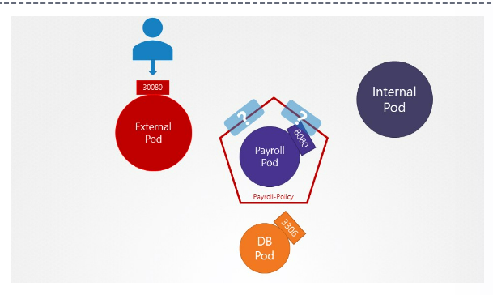
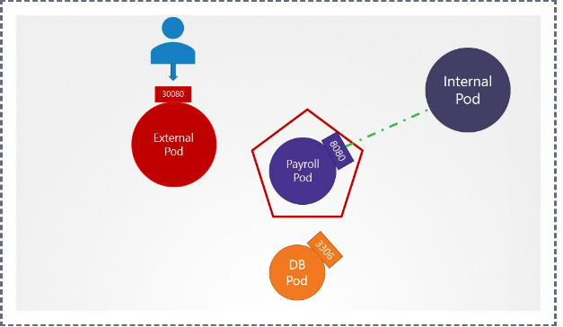
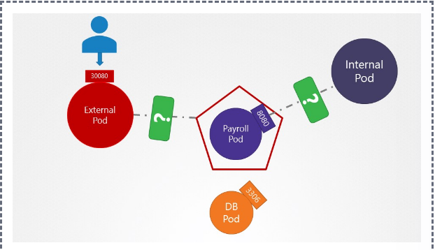
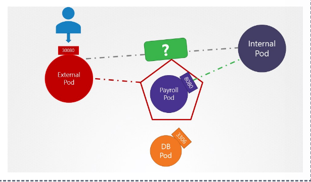

# Network Policies

Ingress 
Egress

## 1. How many network policies do you see in the environment?

We have deployed few web applications, services and network policies. Inspect the environment.


kubectl get networkpolicy or kubectl get netpol

```bash
controlplane ~ ✖ kubectl get netpol
NAME             POD-SELECTOR   AGE
payroll-policy   name=payroll   77s

controlplane ~ ➜  k get pod
NAME       READY   STATUS    RESTARTS   AGE
external   1/1     Running   0          80s
internal   1/1     Running   0          80s
mysql      1/1     Running   0          80s
payroll    1/1     Running   0          80s
```
## 2. What is the name of the Network Policy?
payroll-policy

## 3. Which pod is the Network Policy applied on?
payroll

## 4. What type of traffic is this Network Policy configured to handle?


```bash
controlplane ~ ➜  k describe netpol payroll-policy
Name:         payroll-policy
Namespace:    default
Created on:   2023-04-27 12:39:34 -0400 EDT
Labels:       <none>
Annotations:  <none>
Spec:
  PodSelector:     name=payroll
  Allowing ingress traffic:
    To Port: 8080/TCP
    From:
      PodSelector: name=internal
  Not affecting egress traffic
  Policy Types: Ingress
```
ingress

## 5. What is the impact of the rule configured on this Network Policy?

Traffic From Internal to Payroll POD is allow

## 6. What is the impact of the rule configured on this Network Policy?

Internal POD can ping Payroll POD XXX

External POD can access port 8080 on Payroll POD XXX


Internal POD can access port 8080 on Payroll POD


External POD can ping Payroll POD XXX

## 7. Access the UI of these applications using the link given above the terminal.


## 8. Perform a connectivity test using the User Interface in these Applications to access the payroll-service at port 8080.


Both internal and external applications can access payroll service XXX


Only Internal application can access payroll service

## 9. Perform a connectivity test using the User Interface of the Internal Application to access the external-service at port 8080.


Successful

## 10. Create a network policy to allow traffic from the Internal application only to the payroll-service and db-service.

Use the spec given below. You might want to enable ingress traffic to the pod to test your rules in the UI.

- Policy Name: internal-policy
- Policy Type: Egress
- Egress Allow: payroll
- Payroll Port: 8080
- Egress Allow: mysql
- MySQL Port: 3306

https://kubernetes.io/docs/concepts/services-networking/network-policies/

```bash
controlplane ~ ✖ vi internal-policy.yaml
```

```yaml
apiVersion: networking.k8s.io/v1
kind: NetworkPolicy
metadata:
  name: internal-policy
  namespace: default
spec:
  podSelector:
    matchLabels:
      name: internal
  policyTypes:
  - Egress
  - Ingress
  ingress:
    - {}
  egress:
  - to:
    - podSelector:
        matchLabels:
          name: mysql
    ports:
    - protocol: TCP
      port: 3306

  - to:
    - podSelector:
        matchLabels:
          name: payroll
    ports:
    - protocol: TCP
      port: 8080

  - ports:
    - port: 53
      protocol: UDP
    - port: 53
      protocol: TCP
```
Note: We have also allowed Egress traffic to TCP and UDP port. This has been added to ensure that the internal DNS resolution works from the internal pod.
Remember: The kube-dns service is exposed on port 53:

```bash
root@controlplane:~# kubectl get svc -n kube-system 
NAME       TYPE        CLUSTER-IP   EXTERNAL-IP   PORT(S)                  AGE
kube-dns   ClusterIP   10.96.0.10   <none>        53/UDP,53/TCP,9153/TCP   93m
root@controlplane:~#
```

```bash
controlplane ~ ➜  k create -f internal-policy.yaml
networkpolicy.networking.k8s.io/internal-policy created

controlplane ~ ➜  k describe netpol internal-policy
Name:         internal-policy
Namespace:    default
Created on:   2023-04-27 13:04:43 -0400 EDT
Labels:       <none>
Annotations:  <none>
Spec:
  PodSelector:     name=internal
  Allowing ingress traffic:
    To Port: <any> (traffic allowed to all ports)
    From: <any> (traffic not restricted by source)
  Allowing egress traffic:
    To Port: 3306/TCP
    To:
      PodSelector: name=mysql
    ----------
    To Port: 8080/TCP
    To:
      PodSelector: name=payroll
    ----------
    To Port: 53/UDP
    To Port: 53/TCP
    To: <any> (traffic not restricted by destination)
  Policy Types: Egress, Ingress
```
