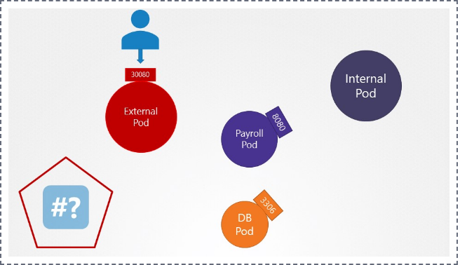

# Network Policies

Ingress 
Egress

## 1. How many network policies do you see in the environment?

We have deployed few web applications, services and network policies. Inspect the environment.



kubectl get networkpolicy or kubectl get netpol

```bash
controlplane ~ ➜  kubectl get networkpolicy
NAME             POD-SELECTOR   AGE
payroll-policy   name=payroll   5m32s

controlplane ~ ➜  kubectl get netpol
NAME             POD-SELECTOR   AGE
payroll-policy   name=payroll   5m51s
```

```bash
```


```bash
```

```bash
```


```bash
```

```bash
```


```bash
```

```bash
```


```bash
```

```bash
```


```bash
```

```bash
```